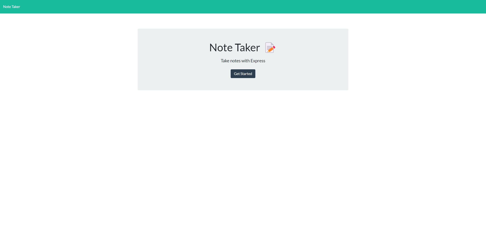
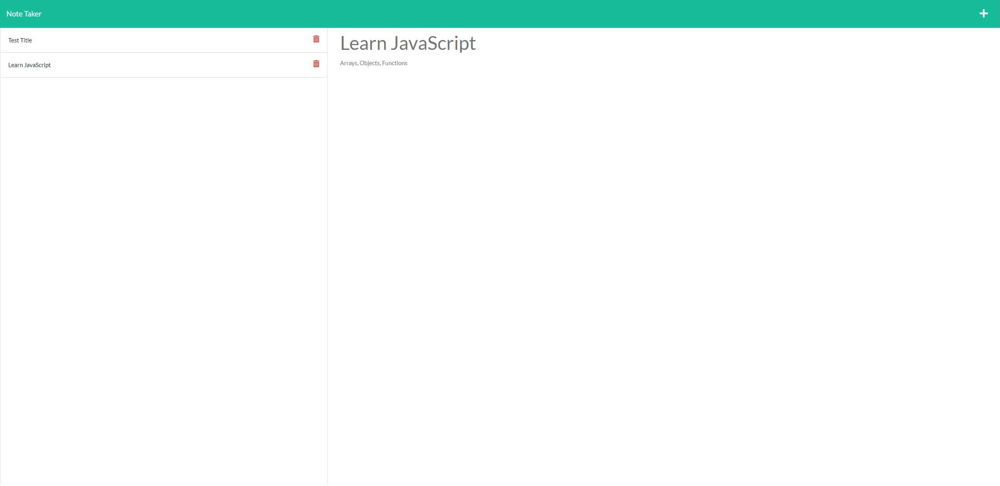

# Readme generator
  

  ## Description
  - Application that allows users to write and save notes so they can keep track of tasks that needs to be completed.
  - Once the task is completed then users can delete it.  
  - The application is also deployed live on Heroku.

  ## Table of Contents
  * [Installation](#installation)
  * [Usage](#usage)
  * [License](#license)
  * [Contributing](#contributing)
  * [Tests](#tests)
  * [Demo](#demo)
  * [Screenshot](#screenshot)
  * [Questions](#questions)

  ## Installation

  - Download node, install  `express, uuid, path and file system` modules.

  ## Usage
  - Run `npm i` to install packages and then,
  - Run `npm start` to start the application.

  ## License
  This project is licensed under 

  ## Contributing
  N/A

  ## Tests
  - N/A

  ## Demo

  Please follow the [link](https://notee-taker.herokuapp.com/) to visit the page.

  ## Screenshot 

  
  

  ## Questions
  If you have any questions regarding the project you can contact me directly at artlil420@gmail.com.
  Please feel free to view more of my projects at https://github.com/Artur0705
